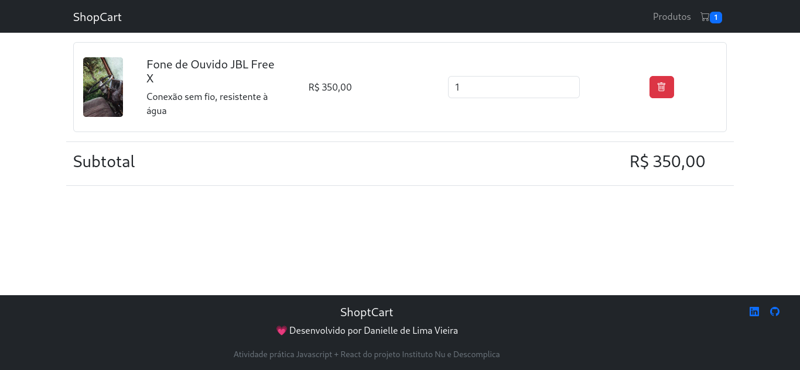

# ShopCart

Frontend de um carrinho de compras e página de produtos de uma loja virtual fictícia. Desenvolvido com ReactJs e React Boostrap.

Atividade prática do módulo Javascript + React do curso de Fundamentos de FrontEnd Development da empresa Descomplica em parceria com o Instituto Nu.

Link Site: https://storeshopcart.netlify.app/
Atividade prática Javascript + React do projeto Instituto Nu e Descomplica.

